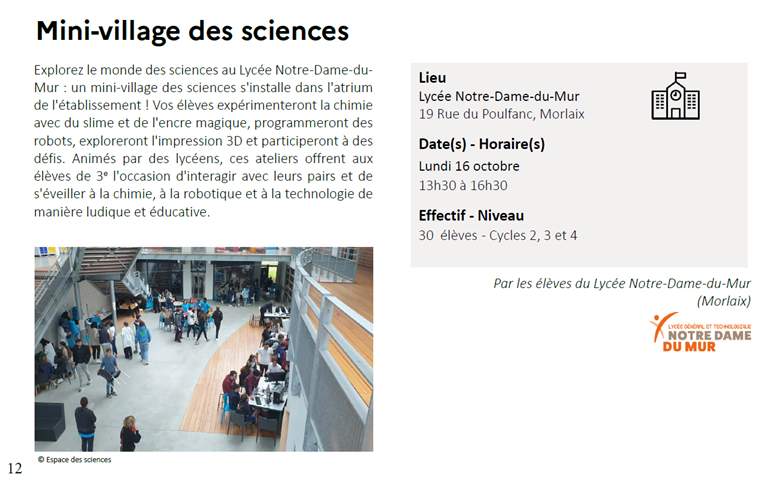

A l'occasion de la fête de la science, Charlène Chartier avec les secondes animation du Porsmeur en collaboration avec Typhaine Lastennet de l’espace des sciences de Morlaix vont organiser, comme l'an passé, un village des sciences sur une journée entière dans l’atrium du lycée le lundi 13 octobre 2025. 

{.center}

Nous accueillerions des élèves de cycle 3 et collège des établissements morlaisiens.

En tant qu'élèves de terminale SI et NSI vous participerez également à cet évènement.

On va essayer de coller au thème retenu pour la Fête de la science : [**Les multiples visages des intelligences**](https://www.fetedelascience.fr/decouvrez-les-multiples-visages-des-intelligences){target=_blank}

<iframe width="560" height="315" src="https://www.youtube.com/embed/3Bc6qb3FSb8?si=756_uGFl4FVjByKu" title="YouTube video player" frameborder="0" allow="accelerometer; autoplay; clipboard-write; encrypted-media; gyroscope; picture-in-picture; web-share" referrerpolicy="strict-origin-when-cross-origin" allowfullscreen></iframe>

## Projets envisagés

<!-- - ...
- ...
- ...
- ... -->

Une première scéance de brainstorming a dégagé quatre domaines à étudier correspondants à différentes formes d'**Intelligences Artificielles** :

- l'intelligence **mécanique** *(Elia, Killian, + Prof)* : c'est celle des algorithmes ou "procédures mécaniques" que l'on embarque dans les rouages d'appareils simples (Boulier, Règle à calculer, Odomètre, Pascaline, Horloge (astronomique), Automates, Enigma, ...) ou de machines plus ou moins automatiques ([Machine de Turing](https://interstices.info/comment-fonctionne-une-machine-de-turing/){target=_blank}, Machine à Commande Numérique CNC et Imprimante 3D, ...), [binaire et logique booléenne, séquence d'instructions, séquenceur, automatismes, engrenages, ordinateur, calculabilité et décidabilité, ... ] ;
- l'intelligence **robotique** *(Augustin, Baptiste, Rémy)* : c'est celle que l'on embarque avec grand renfort de capteurs (NFC, caméra Huskylens, ...) et moteurs (servomoteurs) dans les robots (Cozmo, Lunettes, ...) pour les rendre de plus en plus colaboratifs et autonomes, [] ;
- l'intelligence **domotique** *(Elouan, Luna, Yann)* : c'est celle des solutions techniques architecturales et fonctionnelles de nos foyers d'habitation intégrant de plus en plus d'objets connectés (IOT), [réseau LAN, ESP32, Raspberry PI, ...] ;
- l'intelligence **générative** (Oscar, Adam, Gabriel) : c'est celle dont tout le monde parle sous le nom de ChatGPT, mais est-ce le seul moteur/assistant IA disponible ? Qu'est-ce que l'ingénierie de prompt ? Peut-on concevoir son IA personnelle ? [Agentic IA, ChatBot, LLM, Gemini, Siri, Jarvis, ..., ] ;

> Peut-on affirmer que derrière toutes ces Intelligences Artificielles se cache en réalité toujours de l'intelligence humaine ?

==Votre première mission de projet (sprint) sera donc de construire une médiation scientifique s'appuyant sur les sujets de vos projets respectifs afin de les présenter à des collégiens de quatrième...==

## Démarche

Vous travaillerez en mode agile le professeur jouant le role de [Product Owner](https://www.orientation.com/metiers/product-owner).

Dans chaque équipe vous désignerez un volontaires pour être [Scrum Master](https://www.clementine.jobs/fiches-metiers/metiers-techniques-du-web/scrum-master/#:~:text=Le%20Scrum%20Master%20est%20avant,en%20suivant%20la%20m%C3%A9thode%20Scrum.).

Tout le monde participe activement au développement y compris le [Product Owner](https://www.orientation.com/metiers/product-owner) en cas de besoin (mais pas trop parce qu'il n'a pas que ça à faire !;) ).

Ce projet sera donc aussi l'occasion de redécouvrir et d'expérimenter les rudiments d'une méthode agile que présente les vidéos suivantes...

    <iframe width="560" height="315" src="https://www.youtube-nocookie.com/embed/VpdFpZ_w5x8?start=30" frameborder="0" allow="accelerometer; autoplay; clipboard-write; encrypted-media; gyroscope; picture-in-picture" allowfullscreen></iframe>

    <iframe width="560" height="315" src="https://www.youtube-nocookie.com/embed/-HV_MW5KgVk" frameborder="0" allow="accelerometer; autoplay; clipboard-write; encrypted-media; gyroscope; picture-in-picture" allowfullscreen></iframe>

    <iframe width="560" height="315" src="https://www.youtube-nocookie.com/embed/WNYcSxbJvsc" frameborder="0" allow="accelerometer; autoplay; clipboard-write; encrypted-media; gyroscope; picture-in-picture" allowfullscreen></iframe>

Développer petit à petit de façon modulaire, par fonctionnalité...

## Ressources techniques

### Mécanique

- [Machine de Turing](https://interstices.info/comment-fonctionne-une-machine-de-turing/){target=_blank} ;
- [https://www.cl.cam.ac.uk/projects/raspberrypi/tutorials/turing-machine/](https://www.cl.cam.ac.uk/projects/raspberrypi/tutorials/turing-machine/){target=_blank} ;
- [https://projects-raspberry.com/section-3-building-the-turing-machine/](https://projects-raspberry.com/section-3-building-the-turing-machine/){target=_blank} ;

### Robotique

#### Poppy Ergo Jr

- [https://www.poppy-project.org/fr/robots/poppy-ergo-jr/](https://www.poppy-project.org/fr/robots/poppy-ergo-jr/){target=_blank} ;

- [https://github.com/poppy-project/poppy-ergo-jr](https://github.com/poppy-project/poppy-ergo-jr){target=_blank} ;

#### Huskylens
- wiki.dfrobot [SEN0305_SEN0336](https://wiki.dfrobot.com/HUSKYLENS_V1.0_SKU_SEN0305_SEN0336){target=_blank} + [SEN0336](https://wiki.dfrobot.com/HUSKYLENS_PRO_SKU_SEN0336){target=_blank} ;

### Domotique

#### Home Assistant
- [Transformez votre maison en un foyer intelligent avec le Raspberry Pi](https://www.raspberrypi-france.fr/transformez-votre-maison-en-un-foyer-intelligent-avec-le-raspberry-pi/){target=_blank} ;
- [Serveur domotique raspberry pi 4: guide complet pour une maison intelligente](https://www.conseil-local-energie.com/serveur-domotique-raspberry-pi-4-guide-complet-pour-une-maison-intelligente/){target=_blank} ;

### Générative

- [VittaScience](https://fr.vittascience.com/ia/){target=_blank} ;
- [Exécuter un générateur d'images IA sur ton Raspberry Pi](https://projects.raspberrypi.org/fr-FR/projects/ai-images-on-pi){target=_blank} ;
- [IA génératives : comment bien les utiliser ?](https://www.info.gouv.fr/actualite/ia-generatives-comment-bien-les-utiliser){target=_blank} ;

<!-- 
- [diaporama de présentation](https://ericecmorlaix.github.io/adn-Tutoriel_lab_si/DOC/diaporama/){target=_blank}
- [Lego EV3 en MicroPython](https://ericecmorlaix.github.io/adn-Tutoriel_lab_si/IOT/Lego/EV3/){target=_blank} ;
- [ESP32 client/serveur en MicroPython](https://ericecmorlaix.github.io/adn-Tutoriel_lab_si/IOT/ESP/32/){target=_blank} ;
- [BBC micro:bit + Bluetooh avec HC05](https://ericecmorlaix.github.io/adn-Tutoriel_lab_si/IOT/BBC_microbit/UART/){target=_blank} ;
- [MIT App Inventor sans compte gmail avec l'iPad pour "Compagnon AI"](https://ericecmorlaix.github.io/adn-Tutoriel_lab_si/IHM/MIT_App_Inventor/){target=_blank} ;
- [ThingSpeak](https://ericecmorlaix.github.io/adn-Tutoriel_lab_si/IHM/ThingSpeak/){target=_blank} ;

### LEGO EV3

- [lego ev3 classroom](https://education.lego.com/fr-fr/lessons/ev3-tutorials){target=_blank}

- [pybricks ev3-micropython/](https://pybricks.github.io/ev3-micropython/){target=_blank}

- [Instructions de construction de différents modèles](https://education.lego.com/en-us/product-resources/mindstorms-ev3/downloads/building-instructions#building-core){target=_blank}

### Course en Cours

- [https://www.course-en-cours.com/fr/](https://www.course-en-cours.com/fr/){target=_blank}

### Futur bras 6 axes

- [Onshape - Cinématique bras 6 axes](https://www.youtube.com/playlist?list=PLzeGpFCqKToadNUiOH9iaOi9PymUhzb-M){target=_blank}
- [Le site du bras 6 axes](https://mkx-3d.github.io/bras-6-axes/){target=_blank} -->